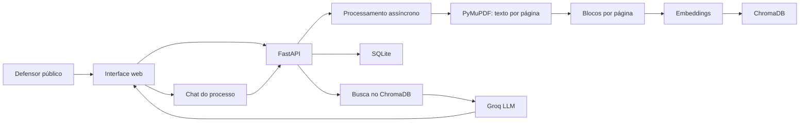

# Arquitetura do v0.1

## Objetivo

O v0.1 deve provar uma coisa antes de qualquer expansão: um defensor público consegue subir um PDF completo do processo, fazer perguntas por chat e receber respostas baseadas exclusivamente no conteúdo recuperado do próprio processo, com páginas citadas.

## Fluxo Geral

## Ingestão do Processo

O defensor sobe o PDF completo do processo.

O backend usa PyMuPDF para extrair o texto página por página, preservando o número de cada página como referência. Se uma página for longa demais, ela é subdividida em blocos menores. Cada bloco mantém:

- ID do processo;
- número da página;
- índice do bloco dentro da página;
- texto extraído;
- tipo de documento quando identificável;
- ID do vetor no ChromaDB.

Depois da extração, os blocos são transformados em vetores de embedding e armazenados no ChromaDB com metadata de origem.

## Consulta via Chatbot

Quando o defensor faz uma pergunta:

1. O sistema converte a pergunta em embedding.
2. Busca no ChromaDB os trechos mais relevantes daquele processo.
3. Envia para o Groq a pergunta e os trechos recuperados.
4. O LLM responde usando exclusivamente os trechos encontrados.
5. A resposta volta citando as páginas usadas.
6. A conversa e as páginas recuperadas são registradas no histórico.

## Endpoints do v0.1

O v0.1 inteiro é coberto por três rotas:

- `POST /upload`: recebe o PDF e dispara processamento assíncrono.
- `GET /processo/{id}/status`: informa se o processamento terminou.
- `POST /processo/{id}/chat`: recebe pergunta e retorna resposta com páginas citadas.

## Schema Mínimo

Tabelas:

- `processos`;
- `chunks`;
- `chat_messages`.

Detalhes do schema ficam em [docs/07-schema-minimo.md](07-schema-minimo.md).

## Risco Principal

O ponto cego do v0.1 é a extração do PDF.

Processos judiciais brasileiros reais frequentemente vêm escaneados, com baixa qualidade de OCR, carimbos, assinaturas e anotações. Se o PyMuPDF não extrair texto limpo, todo o pipeline de citação por página perde a base.

Por isso, o primeiro teste antes de qualquer outra implementação deve ser rodar a extração em um PDF real e ruim fornecido ou validado por um defensor.

## Regra de Produto

O usuário final nunca deve precisar ver termos como chunk, embedding ou vetor. A UI deve falar em páginas, trechos, fontes, resposta e processo.

