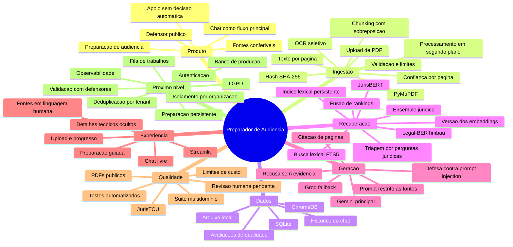

# Mapa mental e registro de decisoes

## Objetivo

Este documento explica como o Preparador de Audiencia chegou ao estado atual, por que cada decisao relevante foi tomada, o que ela resolveu, quais riscos introduziu e qual deve ser seu destino. A avaliacao considera duas realidades diferentes: uma escolha pode ser adequada para uma PoC local e inadequada para um produto com varios defensores e processos reais.

## Legenda

- **Manter**: a decisao continua correta no conceito e na implementacao atual.
- **Manter na PoC**: foi uma boa forma de validar a ideia, mas nao deve chegar sem revisao ao produto.
- **Revisar agora**: ja existe evidencia ou risco suficiente para melhorar durante a PoC.
- **Substituir antes do produto**: pode continuar localmente, mas bloqueia piloto real ou comercializacao.
- **Abandonada corretamente**: foi testada e retirada com justificativa razoavel.
- **Ainda nao validada**: faz sentido como hipotese, mas depende de avaliacao profissional.

## Mapa mental

## Leitura executiva

As melhores decisoes foram preservar a pagina desde a extracao, testar primeiro com PDF ruim, usar RAG em vez de tentar criar uma LLM, restringir a resposta as fontes, separar o codigo por responsabilidades e medir mudancas com benchmarks.

As decisoes que mais se aproximam do limite da PoC sao Streamlit, SQLite, arquivos locais, ChromaDB local, processamento com thread e semaforo e ausencia de autenticacao. Elas nao foram erros. Foram atalhos conscientes para validar a ideia, mas precisam de prazo para sair.

Tres problemas conhecidos nao deveriam esperar pelo piloto ou pela validacao com defensores: o indice FTS5 reconstruido a cada pergunta, a deduplicacao global por SHA-256 e a preparacao de audiencia sem persistencia por secao. O primeiro foi corrigido com indice persistente por processo. Os outros dois continuam como bloqueadores imediatos por risco de isolamento e confiabilidade.

As decisoes ainda sem evidencia suficiente sao a utilidade real da preparacao guiada, a qualidade juridica das respostas e o melhor recuperador para autos completos de primeiro grau. Os benchmarks atuais medem principalmente recuperacao. Eles nao substituem avaliacao de defensores.

## Decisoes de produto

### D01. Tratar o projeto como PoC antes de torna-lo produto

- **Razao**: havia incerteza sobre extracao, OCR, recuperacao e utilidade do chat. Construir billing, multiusuario e uma interface definitiva antes de resolver isso aumentaria custo sem reduzir o risco principal.
- **Avaliacao**: **manter**. Foi a decisao correta e evitou antecipar infraestrutura comercial.
- **Alternativa**: comecar por um SaaS completo. Seria pior porque validaria operacao antes de validar valor.
- **Acao**: definir criterios objetivos para encerrar a PoC e entrar em piloto, evitando uma PoC eterna.

### D02. Escolher o defensor publico como usuario principal

- **Razao**: o problema surgiu da dificuldade concreta de ler processos extensos e preparar audiencia com pouco tempo.
- **Avaliacao**: **ainda nao validada**. A direcao e boa, mas houve pouco acesso continuo a defensores para validar o fluxo.
- **Alternativa**: criar um chatbot juridico generico. Seria mais amplo, mas menos diferenciado e mais dificil de avaliar.
- **Acao**: manter o foco e realizar entrevistas e testes observados com pelo menos tres defensores de areas diferentes.

### D03. Fazer da preparacao de audiencia o recorte central

- **Razao**: e uma tarefa concreta, recorrente e com perguntas praticas, mais delimitada que "analisar qualquer processo".
- **Avaliacao**: **manter**. O recorte da identidade ao produto e orienta o que deve ser recuperado.
- **Alternativa**: resumidor de processos. Seria mais simples, mas resolveria pior o trabalho real e competiria com ferramentas genericas.
- **Acao**: transformar "preparar audiencia" em tarefas mensuraveis: fatos, cronologia, provas, contradicoes, perguntas e checklist.

### D04. Usar chat livre como experiencia principal

- **Razao**: o defensor deve perguntar com suas palavras, sem aprender taxonomias, filtros ou nomes tecnicos.
- **Avaliacao**: **manter**. A conversa e adequada para exploracao, mas nao pode ser a unica forma de trabalho.
- **Alternativa**: formularios e dezenas de botoes. O projeto testou parte desse caminho e a interface ficou carregada e pouco natural.
- **Acao**: manter o chat e oferecer resultados estruturados apenas para tarefas repetiveis, como linha do tempo e checklist.

### D05. Mostrar fontes e paginas em toda resposta

- **Razao**: o usuario precisa conferir rapidamente a origem e a IA nao pode ser tratada como autoridade.
- **Avaliacao**: **manter**. Esta e uma decisao central de confiabilidade, nao um detalhe visual.
- **Alternativa**: apresentar apenas a resposta final. Seria mais limpa, mas juridicamente menos auditavel.
- **Acao**: evoluir de citacao textual para abertura da pagina original no ponto correspondente.

### D06. Nao automatizar decisao juridica nem prometer peca pronta

- **Razao**: a ferramenta deve apoiar julgamento profissional, nao substituir o defensor ou ocultar incerteza.
- **Avaliacao**: **manter**.
- **Alternativa**: oferecer conclusoes e pecas finais automaticamente. Aumentaria risco juridico, etico e de responsabilidade.
- **Acao**: manter linguagem de apoio e exigir confirmacao humana em qualquer sugestao de tese, providencia ou pergunta.

### D07. Trabalhar o backend antes do acabamento visual

- **Razao**: a qualidade do produto depende primeiro de extrair e recuperar informacao correta.
- **Avaliacao**: **manter durante a PoC**. Foi correto adiar polimento enquanto o pipeline mudava.
- **Alternativa**: construir uma interface comercial antes do benchmark. Criaria retrabalho.
- **Acao**: iniciar design de produto apenas depois do primeiro ciclo de validacao profissional, nao depois de toda a engenharia possivel.

## Decisoes de ingestao

### D08. Comecar a validacao por um PDF real e ruim

- **Razao**: o maior risco identificado era o processo escaneado, com carimbos, imagens e OCR ruim.
- **Avaliacao**: **manter**. Foi melhor testar a base do pipeline antes de embeddings e chat.
- **Alternativa**: validar apenas PDFs nativos e limpos. Produziria uma falsa sensacao de prontidao.
- **Acao**: manter uma familia fixa de PDFs dificeis no benchmark de regressao.

### D09. Usar PyMuPDF para extracao nativa

- **Razao**: e local, rapido, preserva paginas e cobre bem PDFs com camada de texto.
- **Avaliacao**: **manter**.
- **Alternativa**: pdfplumber, Apache Tika ou servico externo. Podem ser uteis como fallback, mas nao demonstraram vantagem suficiente para substituir o caminho principal.
- **Acao**: criar uma interface de extrator para permitir fallback por documento sem acoplar o pipeline.

### D10. Acionar OCR apenas em paginas com imagem e pouco texto

- **Razao**: OCR em todas as paginas e lento e pode degradar texto nativo correto.
- **Avaliacao**: **manter**.
- **Alternativa**: OCR integral. E mais simples, mas desperdicaria tempo e introduziria erros desnecessarios.
- **Acao**: melhorar o detector com metricas de qualidade, rotacao, densidade e confianca do OCR.

### D11. Usar RapidOCR e ONNXRuntime localmente

- **Razao**: evita enviar processos para um terceiro e permite validar OCR sem custo por pagina.
- **Avaliacao**: **manter na PoC**.
- **Alternativa**: OCR gerenciado em nuvem pode ser melhor em documentos muito ruins, mas exige contrato, residencia de dados, controle de custos e avaliacao LGPD.
- **Acao**: comparar qualidade e custo com um segundo motor antes do piloto, mantendo opcao totalmente local.

### D12. Preservar o numero da pagina em todo o pipeline

- **Razao**: sem pagina, a resposta nao pode ser conferida no processo.
- **Avaliacao**: **manter**. Esta e uma das decisoes mais importantes do projeto.
- **Alternativa**: indexar texto corrido. Seria mais simples, mas destruiria rastreabilidade.
- **Acao**: acrescentar identificacao do documento ou peca, pagina do PDF e, quando possivel, pagina impressa do documento.

### D13. Dividir texto por caracteres com sobreposicao

- **Razao**: foi uma implementacao simples, previsivel e suficiente para testar RAG preservando a pagina.
- **Avaliacao**: **revisar agora**. Cortes fixos podem separar uma conclusao de sua justificativa e duplicar informacao.
- **Alternativa**: chunking por tokens, paragrafos e estrutura documental, com estrategia pai-filho para recuperar contexto maior.
- **Acao**: executar uma comparacao A/B antes de trocar. A alternativa estrutural e provavelmente melhor, mas precisa manter a citacao por pagina.

### D14. Detectar tipo de documento por palavras-chave

- **Razao**: permitiu adicionar metadata com custo baixo.
- **Avaliacao**: **revisar agora**. A heuristica cobre poucos tipos, confunde mencao com natureza da peca e ainda tem baixo impacto no ranking.
- **Alternativa**: classificador leve por pagina ou bloco, regras por cabecalho e sequencia documental.
- **Acao**: ou tornar a classificacao confiavel e usa-la de verdade, ou retirar a falsa precisao da interface.

### D15. Deduplicar upload pelo SHA-256

- **Razao**: evita repetir OCR e embeddings em um arquivo de 14 MB, reduzindo minutos de espera.
- **Avaliacao**: **revisar agora**. O ganho de desempenho e valido, mas a deduplicacao global pode reutilizar processo, embeddings ou historico entre usuarios e organizacoes diferentes. Em processos com multiplas partes, o mesmo arquivo pode legitimamente chegar a defensores distintos, e a coincidencia do hash nao concede compartilhamento de acesso.
- **Alternativa**: sempre reprocessar. E mais seguro em isolamento, mas muito pior em desempenho.
- **Acao**: antes de qualquer segundo usuario, incluir `tenant_id` ou organizacao na chave de deduplicacao, na consulta de reaproveitamento e em todos os recursos derivados. O hash pode continuar global apenas para integridade interna, nunca para autorizar reutilizacao ou revelar existencia.

### D16. Processar um PDF pesado por vez com semaforo

- **Razao**: protege memoria e CPU em uma maquina local e evita concorrencia destrutiva dos modelos.
- **Avaliacao**: **manter na PoC** e **substituir antes do produto**.
- **Alternativa**: fila persistente com workers, limites por organizacao, cancelamento e retentativa.
- **Acao**: migrar para uma fila real antes de qualquer piloto multiusuario. Thread local nao sobrevive bem a reinicio nem distribui carga.

### D17. Usar dois workers de OCR, zoom 1,5 e embeddings em lotes de 16

- **Razao**: os valores reduziram o tempo do PDF grande sem estourar memoria no ambiente de teste.
- **Avaliacao**: **manter na PoC**.
- **Alternativa**: configuracao adaptativa por CPU, GPU, memoria, numero de paginas e tipo de PDF.
- **Acao**: tratar esses numeros como perfil local, nao como constantes universais de producao.

## Decisoes de arquitetura e dados

### D18. Usar Python e FastAPI

- **Razao**: Python concentra bibliotecas de PDF, OCR, transformers e RAG; FastAPI oferece contratos e API rapidamente.
- **Avaliacao**: **manter**.
- **Alternativa**: Node.js no backend exigiria servicos Python separados para boa parte da IA.
- **Acao**: manter FastAPI e fortalecer limites entre API, dominio, jobs e infraestrutura.

### D19. Separar o codigo em modulos por responsabilidade

- **Razao**: evitou concentrar sessao, criptografia, chat, banco, administracao e rotas em um arquivo gigante.
- **Avaliacao**: **manter**.
- **Alternativa**: um `app.py` central seria mais rapido no primeiro dia e muito pior a cada fase seguinte.
- **Acao**: o proximo passo nao e criar mais arquivos indiscriminadamente, mas consolidar interfaces e casos de uso entre os modulos atuais.

### D20. Manter backend, documentacao e amostras em um monorepo

- **Razao**: uma equipe pequena consegue alterar contrato, pipeline e documentacao na mesma revisao.
- **Avaliacao**: **manter**.
- **Alternativa**: separar repositorios cedo aumentaria coordenacao e versionamento sem beneficio real.
- **Acao**: manter monorepo ate existir equipe ou ciclo de deploy que justifique separacao.

### D21. Usar SQLite para processos, chunks e historico

- **Razao**: instalacao zero, persistencia local e bom suporte para a PoC.
- **Avaliacao**: **manter na PoC** e **substituir antes do produto**.
- **Alternativa**: PostgreSQL oferece concorrencia, migracoes, backups, controle de acesso e isolamento por organizacao.
- **Acao**: adotar PostgreSQL antes do piloto real. Nao esperar SQLite falhar para planejar a migracao.

### D22. Salvar os PDFs no sistema de arquivos local

- **Razao**: e o caminho mais simples para um unico ambiente de desenvolvimento.
- **Avaliacao**: **manter na PoC** e **substituir antes do produto**.
- **Alternativa**: armazenamento de objetos com criptografia, retencao, exclusao e URLs temporarias.
- **Acao**: definir ciclo de vida do arquivo e exclusao verificavel antes de receber processos reais.

### D23. Usar ChromaDB como banco vetorial local

- **Razao**: persistencia simples, filtro por processo e integracao direta com embeddings locais.
- **Avaliacao**: **manter na PoC**.
- **Alternativa**: PostgreSQL com pgvector e busca textual reduziria o numero de sistemas no primeiro produto; Qdrant seria alternativa se escala e busca vetorial avancada justificarem um servico dedicado.
- **Acao**: preferir PostgreSQL mais pgvector no piloto, salvo benchmark que demonstre necessidade de banco vetorial separado.

### D24. Manter uma colecao vetorial por modelo e filtrar por processo

- **Razao**: embeddings de modelos diferentes nao podem compartilhar o mesmo espaco vetorial.
- **Avaliacao**: **manter na PoC**.
- **Alternativa**: colecao por processo e modelo aumenta isolamento, mas cria muitas colecoes e dificulta operacao.
- **Acao**: documentar o comportamento real, pois documentos antigos falam em colecao por processo. No produto, usar tenant e processo como filtros obrigatorios e testados.

### D25. Criar inicialmente tres endpoints essenciais

- **Razao**: upload, status e chat eram suficientes para provar o fluxo central.
- **Avaliacao**: **manter como principio**, nao como limite literal.
- **Alternativa**: desenhar uma API completa antes da PoC.
- **Acao**: reconhecer que a API ja cresceu para busca, listagem e perguntas. Versionar contratos antes de clientes externos, em vez de fingir que ainda existem apenas tres rotas.

### D26. Persistir o historico do chat

- **Razao**: permite auditoria, reproducao e futuras conversas contextuais.
- **Avaliacao**: **revisar agora**. O historico e salvo, mas a geracao atual responde apenas a pergunta corrente.
- **Alternativa**: memoria resumida e limitada, com referencias explicitas ao turno anterior.
- **Acao**: resolver a inconsistencia antes da validacao observada. Se houver conversa multi-turno, implementar memoria curta, controlada e vinculada as fontes; caso contrario, informar explicitamente na interface que cada pergunta e independente.

## Decisoes de recuperacao e IA

### D27. Usar RAG com uma LLM pronta em vez de criar uma LLM propria

- **Razao**: o conhecimento relevante esta no processo enviado e precisa de citacao. Treinar uma LLM exigiria corpus, GPU, avaliacao e governanca que a PoC nao possui.
- **Avaliacao**: **manter**.
- **Alternativa**: fine-tuning pode melhorar formato ou comportamento no futuro, mas nao substitui recuperacao e nao deve ser usado para memorizar processos.
- **Acao**: investir primeiro em dados de avaliacao, recuperacao e prompts. Considerar ajuste fino apenas quando houver erro repetitivo mensuravel.

### D28. Testar BERTikal, JurisBERT e Legal-BERTimbau

- **Razao**: os modelos representam hipoteses diferentes de linguagem juridica brasileira.
- **Avaliacao**: **manter como metodo experimental**.
- **Alternativa**: escolher um modelo por reputacao ou nome. Seria mais rapido e menos confiavel.
- **Acao**: continuar tratando nomes de modelos como candidatos, nao como arquitetura permanente.

### D29. Retirar BERTikal do ensemble padrao

- **Razao**: nos benchmarks executados, ficou abaixo de JurisBERT e Legal-BERTimbau.
- **Avaliacao**: **abandonada corretamente no padrao**.
- **Alternativa**: manter os tres por intuicao. Aumentaria latencia e custo sem evidencia de ganho.
- **Acao**: deixa-lo disponivel para ablacoes futuras, mas exigir ganho mensuravel para voltar.

### D30. Combinar JurisBERT e Legal-BERTimbau no `legal-ensemble`

- **Razao**: o conjunto melhorou cobertura em relacao aos modelos isolados no benchmark disponivel.
- **Avaliacao**: **revisar agora**. O Legal-BERTimbau e voltado a similaridade textual, enquanto o JurisBERT usa mean pooling generico e ainda precisa provar sua contribuicao em uma comparacao equivalente. A fusao pode esconder consultas nas quais um componente reduz a qualidade do outro.
- **Alternativa**: um embedding unico mais um reranker pode entregar qualidade semelhante com menor custo de indexacao e consulta.
- **Acao**: o ensemble permanece somente como baseline da PoC, nao como escolha aprovada para piloto. Ate `02/08/2026`, executar uma ablacao justa com as mesmas perguntas para JurisBERT, Legal-BERTimbau, ensemble e recuperacao lexical hibrida. Medir hit rate, MRR, latencia, armazenamento e degradacoes por tipo de pergunta. O ensemble so permanece padrao se nao degradar nenhum grupo juridicamente relevante acima de 5%, melhorar MRR ou hit rate de forma mensuravel e mantiver latencia compativel com o chat. Sem esse resultado, promover o melhor recuperador isolado e conservar o ensemble apenas para experimento.

### D31. Acrescentar busca lexical FTS5 ao recuperador semantico

- **Razao**: embeddings nao sao ideais para datas, numeros, nomes, resultados e termos literais.
- **Avaliacao**: **manter**. O problema operacional foi corrigido: cada processo agora possui indice FTS5 persistente, criado ou atualizado quando seus chunks mudam e apenas consultado durante o chat.
- **Alternativa**: indice lexical persistente, PostgreSQL FTS ou mecanismo dedicado, combinado por fusao de rankings.
- **Acao**: manter a regressao de ranking e medir processos maiores. No processo local de 149 chunks, a mediana isolada caiu de `3,658 ms` para `1,765 ms`, reducao de `51,7%`, sem alterar os rankings lexicais de 50 perguntas nem as metricas dos benchmarks completos.

### D32. Usar fusao de rankings em vez de misturar scores brutos

- **Razao**: modelos e buscadores produzem scores em escalas diferentes.
- **Avaliacao**: **manter**.
- **Alternativa**: normalizacao calibrada ou reranker sobre candidatos.
- **Acao**: manter a fusao como baseline e testar reranking apenas com gabarito maior.

### D33. Transformar perguntas oficiais em triagem interna

- **Razao**: o usuario escreve naturalmente, enquanto o sistema aproveita vocabulario e objetivos juridicos sem encher a tela de botoes.
- **Avaliacao**: **manter com protecoes**.
- **Alternativa**: mostrar todas as perguntas ou usar uma LLM para classificar toda consulta. A primeira piora a experiencia; a segunda aumenta custo e variabilidade.
- **Acao**: continuar exigindo evidencia forte, preservar a pergunta original e registrar quando a triagem alterou o resultado.

### D34. Dar peso 1,0 a pergunta original e 0,35 a enriquecida

- **Razao**: a triagem deve auxiliar, nao substituir a intencao do defensor.
- **Avaliacao**: **manter como configuracao experimental**, nao como verdade universal.
- **Alternativa**: peso dinamico pela confianca do roteamento ou reranker final.
- **Acao**: aprender o peso com uma suite revisada ou usar faixas de confianca. Evitar ajuste infinito no mesmo conjunto pequeno.

### D35. Escolher Gemini como gerador principal

- **Razao**: na comparacao feita, a resposta foi considerada mais organizada e legivel.
- **Avaliacao**: **manter na PoC**, com ressalvas.
- **Alternativa**: comparar modelos de forma cega com rubrica fixa, custo, latencia e fidelidade, em vez de decidir apenas por preferencia visual.
- **Acao**: manter o provider configuravel e trocar o identificador `preview` por versao estavel antes do produto.

### D36. Manter Groq como fallback

- **Razao**: oferece continuidade quando o principal falha e teve boa velocidade nos testes.
- **Avaliacao**: **manter**.
- **Alternativa**: segundo modelo do mesmo provedor simplifica contrato, mas reduz resiliencia a falha do fornecedor.
- **Acao**: definir quais erros permitem fallback, limite de tentativas, timeout e politica de custo. Quando os dois provedores falham, aplicar a politica da D65: nenhuma resposta e inventada ou enfileirada automaticamente.

### D37. Testar Ollama e depois remove-lo

- **Razao**: modelos locais permitiam comparacao sem chamada externa, mas adicionavam downloads, memoria e operacao sem demonstrar ganho para o fluxo escolhido.
- **Avaliacao**: **abandonada corretamente**.
- **Alternativa**: manter Ollama como terceiro caminho teria valor para privacidade, mas aumentaria a superficie da PoC.
- **Acao**: reconsiderar modelo local apenas se privacidade, operacao offline ou custo se tornarem requisito validado.

### D38. Restringir o prompt as fontes e exigir citacao

- **Razao**: reduz resposta baseada em conhecimento externo e torna afirmacoes conferiveis.
- **Avaliacao**: **manter**.
- **Alternativa**: permitir conhecimento geral do modelo. Poderia enriquecer a explicacao, mas misturaria processo e conhecimento sem rastreabilidade.
- **Acao**: adicionar verificacao automatica de suporte por afirmacao, destacar inferencias separadamente e aplicar a defesa de prompt injection definida na D60.

### D39. Recusar resposta quando nao houver fontes

- **Razao**: uma resposta ausente e menos perigosa que uma resposta juridica inventada.
- **Avaliacao**: **manter**.
- **Alternativa**: responder genericamente. Seria mais agradavel e menos confiavel.
- **Acao**: oferecer proximos passos seguros, como reformular, indicar pagina ou ampliar a busca, sem inventar conteudo.

### D40. Usar uma LLM como avaliador auxiliar

- **Razao**: permite repetir uma rubrica de fidelidade, completude, utilidade e alucinacao sem depender de revisao humana em toda rodada.
- **Avaliacao**: **manter apenas como sinal auxiliar**.
- **Alternativa**: avaliacao humana exclusiva e mais confiavel, mas lenta e cara; avaliacao automatica exclusiva e circular.
- **Acao**: calibrar o avaliador contra notas humanas, usar casos cegos e nunca promover mudanca apenas pela nota da LLM.

## Decisoes de interface

### D41. Usar Streamlit

- **Razao**: permitiu testar upload, progresso, chat e fontes rapidamente.
- **Avaliacao**: **manter na PoC** e **substituir antes do produto comercial**.
- **Alternativa**: React ou Next.js oferece melhor estado, acessibilidade, identidade visual e fluxos complexos, com custo inicial maior.
- **Acao**: migrar somente depois de observar defensores usando o fluxo. Nao reproduzir em React uma experiencia ainda nao validada.

### D42. Separar Chat e Preparacao de audiencia em abas

- **Razao**: diferencia exploracao livre de uma rotina estruturada.
- **Avaliacao**: **ainda nao validada**.
- **Alternativa**: uma unica conversa com comandos contextuais ou um workspace por tarefa.
- **Acao**: testar com usuarios. A aba deve existir apenas se reduzir tempo e carga mental.

### D43. Retirar a lista extensa de perguntas visiveis e usa-las internamente

- **Razao**: os botoes ficaram dificeis de entender e deslocaram o produto de conversar com o caso.
- **Avaliacao**: **abandonada corretamente como interface principal**.
- **Alternativa**: poucas sugestoes contextuais e legiveis, geradas conforme o processo e o momento da preparacao.
- **Acao**: manter triagem invisivel e testar no maximo tres sugestoes contextuais, nunca um catalogo inteiro.

### D44. Mostrar trechos como fontes, mas esconder chunks e vetores

- **Razao**: o defensor precisa de evidencia, nao de detalhes da implementacao.
- **Avaliacao**: **manter**. A interface passou a mostrar pagina, tipo documental quando util e trecho, sem expor indice do chunk nem score.
- **Alternativa**: expor chunks para depuracao. Isso pertence a uma tela tecnica ou modo de desenvolvimento.
- **Acao**: permitir abrir o PDF diretamente na pagina citada.

### D45. Exibir progresso real do processamento

- **Razao**: PDFs grandes levam minutos e uma tela parada parece travada.
- **Avaliacao**: **manter**.
- **Alternativa**: apenas spinner. Nao informa etapa, espera ou falha.
- **Acao**: no produto, acrescentar fila, tempo estimado, notificacao e retomada apos fechar a pagina.

## Decisoes de qualidade, custo e seguranca

### D46. Criar benchmarks antes de continuar expandindo funcionalidades

- **Razao**: sem medida, cada troca de modelo ou prompt vira impressao subjetiva e pode causar regressao.
- **Avaliacao**: **manter**.
- **Alternativa**: depender apenas de demonstracoes manuais. E util para descoberta, mas fraco para engenharia.
- **Acao**: transformar os benchmarks principais em regressao executavel no CI, sem APIs pagas.

### D47. Usar JurisTCU para comparar recuperadores

- **Razao**: oferece consultas e relevancia em portugues juridico em escala maior que os PDFs disponiveis.
- **Avaliacao**: **manter como benchmark tecnico**, nao como validacao do produto.
- **Alternativa**: depender apenas de poucos processos reais. Seria mais proximo do dominio e estatisticamente menor.
- **Acao**: manter familias separadas e nunca escolher o modelo final apenas pelo JurisTCU.

### D48. Criar suite multidominio com PDFs publicos e hashes

- **Razao**: reduz dependencia de um unico dataset, testa o pipeline real e torna as fontes reproduziveis.
- **Avaliacao**: **manter**.
- **Alternativa**: versionar os PDFs no Git. Aumentaria tamanho e risco de licenca ou privacidade.
- **Acao**: ampliar por dominio e tipo de peca, mantendo URLs, hashes, versao e revisao.

### D49. Manter os dez gabaritos multidominio como `pending`

- **Razao**: paginas e termos foram conferidos tecnicamente, mas nao aprovados juridicamente.
- **Avaliacao**: **manter**. E uma sinalizacao honesta da evidencia.
- **Alternativa**: chama-los de gold set sem revisor. Produziria precisao falsa.
- **Acao**: obter revisao profissional, registrar revisor e criterio, e congelar uma versao aprovada.

### D50. Criar travas de custo para testes com LLM

- **Razao**: evita chamadas pagas acidentais durante benchmarks maiores.
- **Avaliacao**: **manter**.
- **Alternativa**: confiar apenas em cuidado manual. E fragil e nao escala para colaboradores.
- **Acao**: acrescentar orcamento por ambiente e telemetria de tokens e custo no piloto.

### D51. Manter chaves em `.env` ignorado e mascarar segredos em erros

- **Razao**: evita versionar credenciais e reduz vazamento por mensagens de erro.
- **Avaliacao**: **manter na PoC**.
- **Alternativa**: secret manager gerenciado, identidade de workload e rotacao automatica.
- **Acao**: usar secret manager antes do deploy e aplicar mascaramento tambem a logs, traces e erros de ingestao.

### D52. Manter tudo local, sem autenticacao, durante a PoC

- **Razao**: reduziu infraestrutura enquanto apenas o desenvolvedor usava a ferramenta.
- **Avaliacao**: **manter somente em desenvolvimento** e **substituir antes de qualquer piloto**.
- **Alternativa**: autenticacao, autorizacao por processo, tenant, auditoria e sessoes seguras desde o inicio.
- **Acao**: bloquear upload de processos reais por terceiros ate existir controle de acesso, exclusao e rate limiting compartilhado conforme a D66.

### D53. Adiar LGPD, multi-tenant e billing

- **Razao**: nao eram necessarios para provar extracao, recuperacao e chat.
- **Avaliacao**: **foi correto adiar**, mas agora se tornam o portao para o piloto.
- **Alternativa**: implementa-los antes da PoC teria atrasado aprendizado; continuar adiando depois do interesse comercial seria imprudente.
- **Acao**: tratar seguranca e LGPD como proxima trilha de produto, antes de captar processos reais de varios profissionais.

### D54. Permitir editar a URL da API na barra lateral

- **Razao**: facilita alternar portas e ambientes durante desenvolvimento local.
- **Avaliacao**: **manter somente no modo de desenvolvimento**.
- **Alternativa**: URL definida por configuracao de ambiente e nao alteravel pelo usuario.
- **Acao**: remover o campo no deploy. Uma URL livre pode induzir o servidor da interface a consultar destinos internos indevidos.

### D55. Recuperar processo por ID, ultimo ou ultimo concluido

- **Razao**: resolveu rapidamente a perda de estado do Streamlit e permitiu retomar testes.
- **Avaliacao**: **manter apenas localmente**.
- **Alternativa**: pagina "Meus casos", filtrada por usuario, organizacao e permissao.
- **Acao**: retirar listagem global antes do piloto. Saber um ID ou pedir o ultimo processo nunca pode conceder acesso.

### D56. Gerar a preparacao de audiencia em seis chamadas sequenciais

- **Razao**: separar resumo, linha do tempo, provas, controversias, perguntas e checklist produz secoes faceis de testar.
- **Avaliacao**: **revisar agora**. O fluxo e lento, caro e perde progresso se a sessao ou uma chamada falhar. Em uma tarefa feita sob pressao de tempo, a falta de retomada compromete a confianca na funcionalidade.
- **Alternativa**: job persistente por secao, com cache, retomada e regeneracao apenas do item escolhido.
- **Acao**: antes da validacao com defensores, manter as seis tarefas como taxonomia, mas persistir estado e resultado de cada secao. Permitir retomada, retentativa idempotente e regeneracao somente da parte escolhida.

### D57. Enviar trechos do processo a provedores externos de LLM

- **Razao**: tornou possivel validar rapidamente qualidade de geracao sem hospedar uma LLM.
- **Avaliacao**: **aceitavel apenas com documentos publicos ou anonimizados na PoC**.
- **Alternativa**: contrato empresarial com retencao adequada, endpoint privado ou modelo local sob requisito de sigilo.
- **Acao**: antes de processos reais, documentar suboperadores, regiao, retencao, transferencia internacional e exclusao. O fallback deve obedecer ao mesmo nivel de privacidade do principal.

### D58. Validar o PDF antes de aceitar a ingestao

- **Razao**: extensao `.pdf` e assinatura inicial nao garantem que o arquivo seja integro, legivel, permitido ou processavel. PDFs corrompidos, protegidos por senha, vazios, excessivamente grandes ou com estruturas malformadas devem falhar de maneira controlada antes de consumir OCR e embeddings.
- **Avaliacao**: **revisar agora**. A ausencia de contrato de entrada transforma rejeicoes previsiveis em erros tardios e pouco compreensiveis.
- **Alternativa**: aceitar qualquer arquivo e deixar cada biblioteca falhar. E mais simples, mas gera desperdicio, mensagens inconsistentes e maior superficie de abuso.
- **Acao**: definir tamanho e numero maximo de paginas por ambiente; validar assinatura, MIME, abertura, criptografia, senha, quantidade de paginas e disponibilidade de texto ou imagem. Rejeitar com codigo e mensagem claros, sem registrar conteudo sensivel, e manter testes para PDF corrompido, protegido, vazio e acima do limite.

### D59. Tratar falha parcial e confianca do OCR por pagina

- **Razao**: OCR pode retornar algum texto e ainda assim errar nomes, datas, valores ou a ordem da leitura. Aceitar qualquer saida como equivalente a texto confiavel compromete recuperacao e citacao.
- **Avaliacao**: **revisar agora**. Uma citacao formalmente correta para uma pagina extraida com baixa qualidade pode transmitir confianca indevida.
- **Alternativa**: descartar toda pagina com OCR imperfeito. Evita texto ruim, mas elimina informacao que ainda pode ser util com aviso e revisao.
- **Acao**: a politica inicial foi implementada. Texto nativo legivel recebe confianca alta; OCR substancial sem medida nativa do motor recebe confianca media e exige conferencia visual; OCR vazio, muito curto ou esparso recebe confianca baixa. A confianca acompanha pagina, chunk, indice e fonte. `Desconhecida` equivale operacionalmente a baixa: o chunk e excluido do contexto da LLM. Se nao restar fonte alta ou media, a resposta e bloqueada e indica as paginas para conferencia. Se houver outras fontes confiaveis, a resposta usa somente elas e avisa quais paginas foram descartadas. O status identifica processos legados e a rota `POST /processo/{id}/reprocessar` refaz extracao, chunks e indices a partir do PDF original. Todo legado deve ser reprocessado antes da proxima validacao externa; se o original nao existir, o processo permanece bloqueado ate novo upload. O proximo incremento deve capturar a confianca numerica do motor, testar rotacao e calibrar os limiares em paginas reais.

### D60. Tratar o conteudo recuperado como dado nao confiavel contra prompt injection

- **Razao**: processos podem conter instrucoes, peticoes, anexos ou texto malicioso dizendo ao modelo para ignorar regras, revelar dados ou executar outra tarefa. O documento recuperado e evidencia, nao instrucao.
- **Avaliacao**: **revisar agora**. Restringir o prompt as fontes reduz alucinacao, mas nao neutraliza instrucoes contidas nas proprias fontes.
- **Alternativa**: confiar apenas no prompt de sistema. E insuficiente porque o modelo ainda recebe texto adversarial no contexto.
- **Acao**: alem da separacao no prompt, existe agora uma barreira deterministica antes da LLM para padroes fortes de alteracao de regras, revelacao de segredo e mudanca de papel. Trechos sinalizados sao excluidos; se forem as unicas fontes, a resposta e bloqueada e as paginas sao indicadas para conferencia. A taxonomia versionada em `docs/29-taxonomia-prompt-injection.md` define tres niveis com cinco exemplos iniciais por nivel. Critico tenta substituir regras, fabricar fato, remover citacao, mudar papel ou extrair segredo e exige bloqueio de 100%. Medio cobre ataques indiretos, estruturais, em outro idioma ou ofuscados e exige ao menos 80% de sinalizacao, sem alteracao silenciosa da resposta. Baixo mede texto legitimo e exige falso positivo abaixo de 5% no corpus ampliado. Ate `02/08/2026`, executar a taxonomia em PDFs publicos e sinteticos renderizados, incluindo peticoes, cabecalhos, anexos e OCR. Nenhuma validacao externa com upload real deve ocorrer antes de todos os criterios serem atendidos.

### D61. Versionar embeddings e planejar reindexacao

- **Razao**: vetores de modelos, revisoes, pooling ou normalizacoes diferentes nao pertencem ao mesmo espaco. Trocar qualquer componente sem versao pode tornar documentos existentes incompativeis com consultas novas.
- **Avaliacao**: **revisar agora no contrato de dados**. Mesmo na PoC, os modelos continuam sendo comparados e podem mudar.
- **Alternativa**: apagar e reconstruir toda a base manualmente a cada troca. Funciona em laboratorio pequeno, mas causa indisponibilidade, perda de rastreabilidade e risco operacional.
- **Acao**: versionar `modelo`, `revisao`, `pooling`, `dimensao`, `normalizacao`, `chunking` e versao do pipeline em cada indice. Criar reindexacao idempotente e observavel, manter versoes paralelas durante migracao e promover a nova versao somente depois do benchmark e da verificacao de cobertura.

### D62. Fazer validacao de produto antes de concluir toda a engenharia do piloto

- **Razao**: resolver riscos tecnicos conhecidos antes do piloto evita feedback contaminado, mas adiar todo contato com defensores pode levar o projeto a aperfeicoar uma preparacao de audiencia que nao corresponde ao trabalho real.
- **Avaliacao**: **fazer agora em duas etapas**. Descoberta de produto e piloto tecnico nao sao a mesma coisa.
- **Alternativa**: concluir todas as pendencias tecnicas e somente depois mostrar o produto. Reduz exposicao, mas aumenta o risco de construir a funcionalidade errada.
- **Acao**: em `26/07/2026`, o acesso a dois defensores ainda esta **nao confirmado**, portanto `30/07/2026` deixa de ser apresentado como data garantida da sessao e passa a ser gate de agendamento. Ate essa data devem existir dois convites enviados e pelo menos uma resposta com janela concreta. A primeira sessao deve ocorrer em ate sete dias corridos apos a primeira confirmacao. Se nenhum acesso for confirmado, o desenvolvimento das seis secoes nao avanca alem de manutencao e seguranca; o esforco migra para recrutamento, entrevista remota ou teste de roteiro com um defensor disponivel. A sessao dura 30 a 45 minutos, usa material publico, anonimizado ou clicavel e observa localizar fato com pagina, compreender evento temporal e preparar pontos para audiencia. Upload sigiloso continua proibido ate os gates tecnicos.

### D63. Definir exclusao completa e retencao por caso

- **Razao**: PDF, texto, vetores e conversa deixam de ser necessarios quando o caso e encerrado ou quando o titular solicita exclusao. Retencao indefinida amplia o impacto de incidente e conflita com minimizacao de dados.
- **Avaliacao**: **decidir antes do piloto e implementar antes do segundo usuario real**.
- **Alternativa**: manter tudo por conveniencia operacional. Facilita reuso, mas nao e justificavel para dados juridicos potencialmente sigilosos.
- **Acao**: oferecer exclusao explicita por processo e politica configuravel de retencao. Uma exclusao deve remover arquivo original, chunks, indices lexicais, todas as colecoes vetoriais versionadas, mensagens, avaliacoes, preparacoes e artefatos temporarios; depois deve gerar comprovante tecnico sem conteudo sensivel. Logs e traces nao devem registrar texto, nome de arquivo, pergunta, trecho ou `processo_id` bruto; usar identificador de correlacao ou HMAC rotativo com retencao maxima definida. O teste de aceite deve procurar o identificador e dados marcadores tambem em logs, traces, filas, cache, temporarios e telemetria. Backups devem ter expiracao documentada e impedir restauracao seletiva de caso ja excluido sem nova base legal.

### D64. Declarar limite de cobertura quando a pergunta exige o processo inteiro

- **Razao**: RAG seleciona trechos e reduz o contexto, mas pode omitir relacoes espalhadas por muitas paginas. Uma resposta parcial pode parecer completa se o sistema nao declarar o limite.
- **Avaliacao**: **manter como limitacao conhecida e tratar explicitamente**.
- **Alternativa**: enviar o processo inteiro para a LLM. Isso falha em processos grandes, aumenta custo e ainda nao garante atencao uniforme.
- **Acao**: perguntas como `resumo completo`, `todos os fatos` ou `processo inteiro` recebem aviso deterministico de que a resposta cobre apenas os trechos recuperados. Para oferecer analise integral no futuro, criar pipeline hierarquico por documento e secao, gerar resumos verificaveis com cobertura de paginas, recuperar esses resumos e informar cobertura medida. Ate la, o sistema nao deve chamar uma resposta RAG de analise completa.

### D65. Tratar indisponibilidade simultanea de Gemini e Groq

- **Razao**: fallback reduz falhas, mas nao elimina indisponibilidade de rede, cota, credencial ou dos dois provedores.
- **Avaliacao**: **politica inicial implementada**.
- **Alternativa**: enfileirar a pergunta e responder depois. Isso pode gerar resposta fora do contexto temporal do defensor e exige notificacao, validade e cancelamento que a PoC ainda nao possui.
- **Acao**: depois de uma tentativa controlada no Gemini e outra no Groq, a API retorna `503` com mensagem recuperavel e nao fabrica resposta. A pergunta e a falha ficam registradas, sem segredo no erro. A interface entra em modo somente consulta e mostra os trechos recuperados como material para conferencia manual, deixando claro que nao houve resposta da LLM. O processo continua acessivel e o usuario pode reenviar a pergunta. Retentativa automatica e fila so entram quando houver job persistente, prazo de validade, cancelamento e notificacao.

### D66. Aplicar rate limiting e limite de concorrencia antes do piloto

- **Razao**: upload, OCR e embeddings consomem CPU, memoria, disco e chamadas externas. Autenticacao identifica o usuario, mas nao impede abuso ou esgotamento acidental.
- **Avaliacao**: **obrigatorio antes de expor a API**.
- **Alternativa**: depender apenas do limite local configuravel e do semaforo local. Isso limita um processo por instancia, mas permite fila ilimitada e nao funciona entre replicas.
- **Acao**: no piloto, usar contador compartilhado em Redis ou gateway, nunca apenas memoria do processo. Baseline inicial: upload com tres requisicoes por minuto por usuario e dez por hora por organizacao; no maximo um processamento ativo por usuario e tres por organizacao; chat com 30 requisicoes por minuto por usuario e 120 por organizacao. Excedentes retornam `429` com `Retry-After`, sem ler o arquivo inteiro nem iniciar background task. A fila deve ser limitada e observavel. Os valores so podem mudar com teste de carga e registro da decisao.

## Decisoes que mudaram ao longo do projeto

| Antes | Depois | Avaliacao |
|---|---|---|
| Groq como gerador principal | Gemini principal e Groq fallback | Mudanca razoavel apos comparar legibilidade, mas falta avaliacao cega maior |
| BERTikal como modelo juridico inicial | JurisBERT mais Legal-BERTimbau | Mudanca sustentada pelo benchmark disponivel |
| Tres BERTs trabalhando juntos | Ensemble com os dois melhores | Corretamente removeu custo sem ganho demonstrado |
| Apenas busca semantica | Busca hibrida semantica e lexical | Correcao importante para dados exatos |
| Perguntas como botoes visiveis | Perguntas como triagem interna | Melhor alinhamento com o chat livre |
| Upload sempre reprocessado | Reutilizacao por hash | Grande ganho local; isolamento por tenant agora e prioridade imediata |
| Spinner e espera pouco clara | Status por etapa e progresso | Melhora necessaria para PDF grande |
| Poucos testes manuais | Bancadas, custos limitados e suite multidominio | Evolucao correta, ainda sem gold set profissional |
| Ollama como comparador local | Ollama removido | Reducao coerente de escopo |

## Arquitetura recomendada por etapa

### Enquanto ainda e PoC

Manter FastAPI, Streamlit, SQLite, ChromaDB local e Gemini com Groq fallback. O indice lexical ja foi persistido, a interface declara que cada pergunta e independente e o chat aplica a politica conservadora de OCR e a barreira inicial de prompt injection. Fazer descoberta de produto agora somente com material publico, anonimizado ou sintetico. Antes de qualquer upload sigiloso ou piloto com mais de um usuario, isolar a deduplicacao por tenant, implementar exclusao completa, tornar a preparacao retomavel e concluir os gates de seguranca. Manter o `legal-ensemble` apenas como baseline provisoria ate a ablacao equivalente.

### Para um piloto controlado

Migrar para PostgreSQL com pgvector e busca textual, fila persistente de processamento, armazenamento de objetos criptografado, autenticacao, isolamento por organizacao, auditoria, politica de retencao e observabilidade. Tambem e obrigatorio criar exclusao completa de PDF, chunks, vetores, chat e avaliacoes. O frontend pode continuar simples, mas nao deve depender de estado local do Streamlit para sessoes de varios usuarios.

### Para produto comercial

Usar frontend dedicado, contratos de API versionados, limites de uso, monitoramento de custo, backups, resposta a incidente, termos de uso, base legal e governanca LGPD. Modelos, prompts e recuperadores devem ser versionados e promovidos somente apos regressao automatica e aprovacao humana em amostra juridica.

## Ordem recomendada das proximas decisoes

1. **Concluido:** persistir a busca lexical por processo e preservar a regressao de relevancia.
2. Confirmar ate `30/07/2026` o agendamento da validacao minima; realizar a primeira sessao em ate sete dias da primeira confirmacao.
3. Concluir ate `02/08/2026` a ablacao do ensemble e o primeiro corpus adversarial, mantendo ambos como gates de piloto.
4. Corrigir a deduplicacao para que o reaproveitamento seja limitado por tenant e permissao.
5. Implementar exclusao completa por processo, incluindo logs e traces, e definir retencao antes do segundo usuario real.
6. Persistir a preparacao de audiencia por secao, com retomada, cache e retentativa idempotente, caso a validacao confirme o formato.
7. Implementar validacao de entrada do PDF e contrato de versao dos embeddings; calibrar confianca do OCR com paginas reais.
8. Manter explicito que as perguntas sao independentes e somente implementar memoria multi-turno com contrato e testes proprios.
9. Revisar e aprovar a suite multidominio, acrescentando respostas de referencia e cobertura de perguntas amplas.
10. Definir a arquitetura do piloto com autenticacao, tenant, rate limiting compartilhado, PostgreSQL, fila e armazenamento seguro.
11. Somente depois investir na interface comercial e em billing.

## Conclusao

O projeto nao escolheu uma arquitetura ruim. Ele escolheu uma arquitetura deliberadamente pequena para descobrir se a ideia funcionava. O risco agora nao e o que foi feito no inicio, mas deixar componentes de validacao local assumirem responsabilidades de producao.

A melhor estrategia nao e reescrever tudo. E preservar as decisoes fortes, substituir os atalhos nos limites corretos e exigir evidencia antes de cada troca de modelo ou tecnologia.
